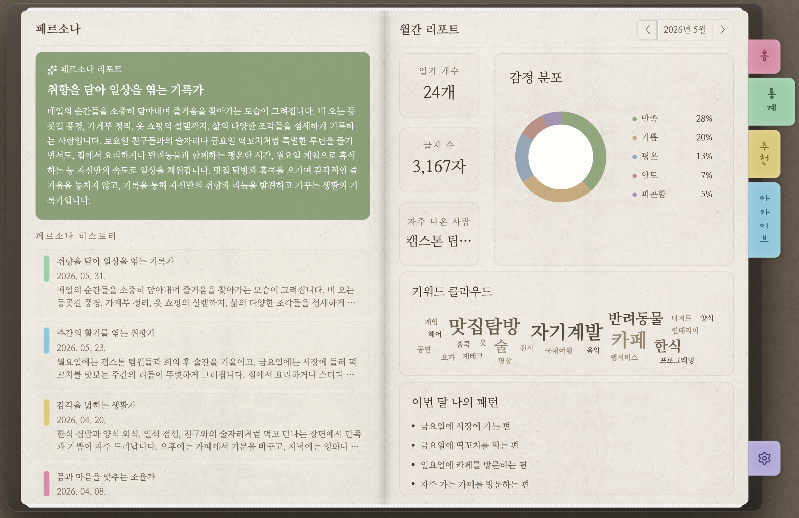
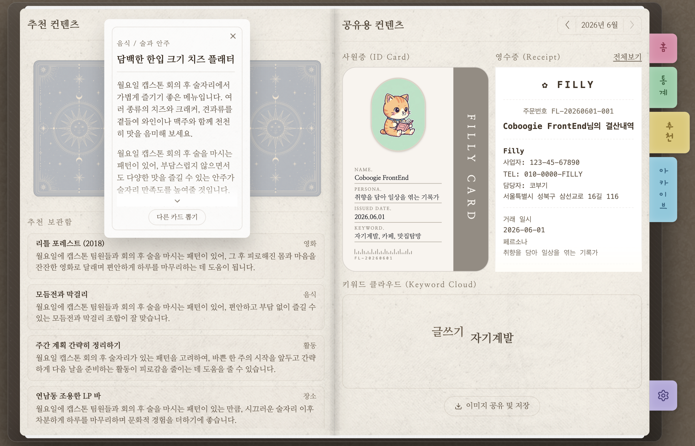
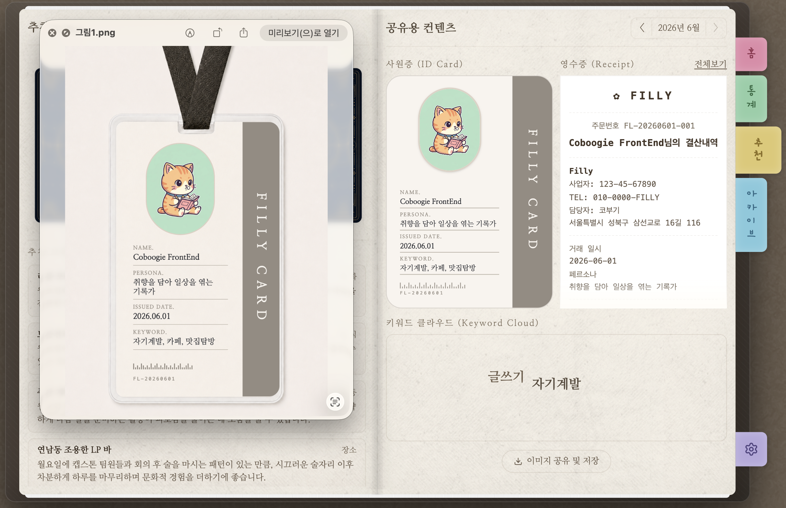

# 📒 Filly

<div align="center"> <kbd>  </kbd> <br /> <br /> <p> <strong>오늘을 쉽게 기록하고 나를 이해하는 시간</strong> </p> <p> Filly는 짧은 기록과 음성 입력으로 일기 작성을 쉽게 시작하게 하고,<br /> 쌓인 기록을 AI로 분석해 나를 이해할 수 있는 콘텐츠를 추천하는 서비스입니다. </p> </div>

> 배포 링크 <br /> https://filly-diary.com/

## ✍🏻 프로젝트 개요

Filly는 AI를 활용해 사용자의 일기 작성을 돕고, 축적된 기록을 기반으로 감정, 키워드, 생활 패턴, 페르소나를 분석하는 서비스입니다.

사용자는 짧은 문장이나 음성으로 하루를 남기고 AI가 생성한 초안을 편집해 일기를 완성할 수 있습니다. 작성된 일기는 캘린더에서 다시 확인할 수 있으며, 월별 통계와 추천 콘텐츠, 아카이브 기능을 통해 기록을 더 의미 있게 관리할 수 있습니다.

## 🚀 핵심 기능

### AI로 일기 초안을 만들 수 있어요

짧은 메모와 음성을 바탕으로 AI 일기 초안을 생성합니다. 사용자는 생성된 초안을 TipTap 기반 에디터에서 수정하고, 감정 이모지와 사진을 함께 저장할 수 있습니다.


### 월간 통계로 나의 감정과 패턴을 돌아볼 수 있어요

월별 감정 분포, 키워드 클라우드, 생활 패턴을 시각적으로 제공합니다. 최근 기록을 바탕으로 생성된 페르소나 리포트와 히스토리도 확인할 수 있습니다.



### 나에게 맞는 추천을 받을 수 있어요

사용자의 일기와 통계 데이터를 기반으로 카드형 추천 콘텐츠를 제공합니다. 추천 결과와 함께 사원증, 영수증, 키워드 클라우드 이미지를 저장할 수 있습니다.



### 공유용 콘텐츠를 만들 수 있어요

사용자의 분석 결과를 사원증, 영수증, 키워드 클라우드 같은 이미지 형태로 저장할 수 있습니다. 나의 기록과 취향을 SNS에 공유하기 쉬운 콘텐츠로 제공합니다.



## ⚙️ 기술 스택

| 분류                  | 기술 스택                                  |
| --------------------- | ------------------------------------------ |
| 공통                  | TypeScript                                 |
| 프론트엔드            | React 18, Vite, React Router, Tailwind CSS |
| 상태 관리 / 서버 상태 | TanStack Query                             |
| API 통신              | Axios                                      |
| 에디터                | TipTap                                     |
| 인터랙션              | Framer Motion, Lucide React, React Icons   |
| 이미지 생성 / 저장    | html-to-image                              |
| 패키지 매니저         | npm                                        |
| 배포                  | Firebase Hosting 설정 포함                 |

## 📁 프로젝트 구조

```text
src/
  api/          서버 API 호출 모듈
  app/          라우팅과 공통 앱 레이아웃
  assets/       폰트, 이미지, 텍스처 등 정적 에셋
  components/   재사용 UI 컴포넌트
  hook/         공통 훅과 React Query 훅
  lib/          날짜, 일기, 배경 테마 등 순수 유틸리티
  pages/        페이지 단위 화면
  styles/       전역 스타일과 theme.css 디자인 토큰
  types/        도메인 타입 정의
```

## 🧑‍💻 Team

| [이주연](https://github.com/juyeon707)                                                                                             | [천일영](https://github.com/ilyeong34)                                                                                             |
| ---------------------------------------------------------------------------------------------------------------------------------- | ---------------------------------------------------------------------------------------------------------------------------------- |
|  |  |
| <div align="center">만두가 좋아~</div>                                                                                             | <div align="center">🫪</div>                                                                                                       |
